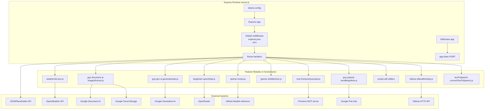

# Application Runtime and API Surface

## Overview

`server.js` is the active Express runtime for this repository. It loads environment variables, creates a single Express app, enables JSON parsing and CORS globally, registers the HTTP routes in-process, prints the live route list, and starts the server on `PORT` with a default of `5000`.

The application surface is a thin HTTP layer over several feature modules in `functions/src/`. Those modules handle weather lookups, Google Document AI extraction, Gemini/OpenRouter prompt generation, OpenAI/GitHub-model review flows, MCP Firestore access, Pub/Sub alert publishing, PDF utilities, Ollama-backed prompt handling, and a text-to-speech router. The root route is a demo HTML response that fetches user data from JSONPlaceholder and renders it directly.

## Architecture Overview



## Runtime Bootstrap

### Environment loading and application creation

- `server.js` imports `dotenv` and immediately calls `dotenv.config()`.
- `express`, `axios`, and `cors` are initialized in the same entrypoint.
- `const app = express();` creates the singleton HTTP application.
- `const PORT = process.env.PORT || 5000;` controls the listening port.

The entrypoint also imports handler modules from `functions/src/`, including:

- `getWeatherByCity`
- `processDocumentFromGCS`
- `processDocumentFromLocal`
- `sendPromtOutput`
- `sendOpenAiPrompt`
- `queryApi`
- `slotGame`
- `reviewCode`
- `sendMsgAlerts`
- `downloadPdfFromUrl`
- `extractRecrodFromDocument`
- `unlockPdfDocument`
- `ttsRouter`
- `sendOllamaPrompt`

### Global middleware

`server.js` installs two middleware layers before any route handler:

1. `app.use(express.json())`
2. `app.use(cors())`

That means all JSON bodies are parsed at the application boundary, and all routes are exposed with permissive cross-origin access.

### Route registration order

The visible runtime registers routes in this order:

1. `GET /`
2. `GET /images-scan`
3. `GET /weather`
4. `POST /api/gen-ai`
5. `POST /api/open-ai`
6. `POST /api/firestore-query-ai`
7. `GET /api/slot-machine`
8. `POST /api/review-code`
9. `POST /send-message-alerts`
10. `GET /download-pdf`
11. `POST /extract-pdf`
12. `POST /unlock-pdf`
13. `POST /ollama`
14. `POST /ollama-chat`
15. `ttsRouter` mount
16. `listRoutes(app)`
17. `app.listen(PORT, ...)`

### Route listing helper

listRoutes(app) only walks app._router.stack entries that have a direct route. Any handler mounted through app.use(...), including router-based endpoints, is skipped by the listing logic.

`server.js` defines a local helper:

| Function | Description |
| --- | --- |
| `listRoutes(app)` | Prints `METHOD http://localhost:PORT/path` for each direct Express route registered on `app`. |


Its behavior is straightforward:

- reads `app._router.stack`
- filters stack entries where `r.route` exists
- prints the first method key for each route
- prints the route path with the current `PORT`

## Imported Module Boundaries

### Weather service

*File: `functions/src/weather/weatherService.js`*

| Method | Description |
| --- | --- |
| `getWeatherByCity` | Calls OpenWeather by city name and returns a normalized weather object. |


### Document AI image extraction

*File: `functions/src/gcp/document-ai/imagesExtract.js`*

| Method | Description |
| --- | --- |
| `processDocumentFromGCS` | Triggers the GCS-based Document AI workflow and returns extracted entity data. |
| `processDocumentFromLocal` | Triggers the local-file Document AI workflow. |


### Generative AI prompt bridge

*File: `functions/src/gcp/gen-ai/generativeApi.js`*

| Method | Description |
| --- | --- |
| `sendPromtOutput` | Sends a text prompt to the configured generative model and returns the generated text. |


### MCP Firestore query bridge

*File: `functions/src/mcp/firestoreQueryApi.js`*

| Method | Description |
| --- | --- |
| `queryApi` | Connects to the Smithery-hosted Firestore MCP server and lists available tools. |


### Slot machine utility

*File: `functions/src/games/slotMachine.js`*

| Method | Description |
| --- | --- |
| `slotGame` | Generates a three-symbol slot result and a win or loss message. |


### Code review service

*File: `functions/src/openai/review.js`*

| Method | Description |
| --- | --- |
| `reviewCode` | Submits a hard-coded JavaScript sample to GitHub Models and returns the generated review text. |


### Pub/Sub alert publisher

*File: `functions/src/gcp/pubsub/sendMsgAlerts.js`*

| Method | Description |
| --- | --- |
| `sendMsgAlerts` | Publishes a message payload to the configured Pub/Sub topic and returns the published message ID or an error message. |


### Ollama bridge

*File: `functions/src/ollama/ollamaRestApi.js`*

| Method | Description |
| --- | --- |
| `sendOllamaPrompt` | Sends a prompt to the configured Ollama model endpoint. |


### PDF utilities

*Files: `functions/src/scripts/downloadPdfByUrl.js`, `functions/src/scripts/extractDataFromPdf.js`, `functions/src/scripts/unlockPdfPassword.js`*

| Method | Description |
| --- | --- |
| `downloadPdfFromUrl` | Downloads a PDF from a URL. |
| `extractRecrodFromDocument` | Extracts data from a PDF document. |
| `unlockPdfDocument` | Unlocks a password-protected PDF. |


### Text-to-speech router

*File: `functions/src/textToSpeech/convertTextToSpeech.js`*

| Export | Description |
| --- | --- |
| `ttsRouter` | Express router for text-to-speech related HTTP endpoints. |


## HTTP Endpoint Map

### Root demo page

#### Root HTML User List

```api
{
    "title": "Root HTML User List",
    "description": "Fetches users from JSONPlaceholder and returns an HTML list rendered directly from the response data",
    "method": "GET",
    "baseUrl": "<ServerBaseUrl>",
    "endpoint": "/",
    "headers": [],
    "queryParams": [],
    "pathParams": [],
    "bodyType": "none",
    "requestBody": "",
    "formData": [],
    "rawBody": "",
    "responses": {
        "200": {
            "description": "Success",
            "body": "<h1>User List</h1><ul><li><strong>Leanne Graham</strong> - Sincere@april.biz</li></ul>"
        }
    }
}
```

### Document extraction

#### Scan Document From GCS

```api
{
    "title": "Scan Document From GCS",
    "description": "Runs the Document AI extraction flow and wraps the extracted entity map in a data object",
    "method": "GET",
    "baseUrl": "<ServerBaseUrl>",
    "endpoint": "/images-scan",
    "headers": [],
    "queryParams": [],
    "pathParams": [],
    "bodyType": "none",
    "requestBody": "",
    "formData": [],
    "rawBody": "",
    "responses": {
        "200": {
            "description": "Success",
            "body": "{\n    \"data\": {\n        \"invoice_number\": \"INV-1024\",\n        \"customer_name\": \"Acme Corp\",\n        \"total_amount\": \"245.00\"\n    }\n}"
        }
    }
}
```

### Weather

#### Get Weather By City

```api
{
    "title": "Get Weather By City",
    "description": "Fetches current weather for the city provided in the query string and returns normalized weather fields",
    "method": "GET",
    "baseUrl": "<ServerBaseUrl>",
    "endpoint": "/weather",
    "headers": [],
    "queryParams": [
        {
            "key": "city",
            "required": true,
            "description": "City name used by OpenWeather"
        }
    ],
    "pathParams": [],
    "bodyType": "none",
    "requestBody": "",
    "formData": [],
    "rawBody": "",
    "responses": {
        "200": {
            "description": "Success",
            "body": "{\n    \"city\": \"Delhi\",\n    \"temperature\": 30,\n    \"description\": \"clear sky\",\n    \"humidity\": 40,\n    \"windSpeed\": 5\n}"
        }
    }
}
```

#### Note on the weather handler

### Generative AI

#### Generate AI Content

```api
{
    "title": "Generate AI Content",
    "description": "Sends the prompt to sendPromtOutput and returns the generated text inside a response envelope",
    "method": "POST",
    "baseUrl": "<ServerBaseUrl>",
    "endpoint": "/api/gen-ai",
    "headers": [
        {
            "key": "Content-Type",
            "value": "application/json",
            "required": true
        }
    ],
    "queryParams": [],
    "pathParams": [],
    "bodyType": "json",
    "requestBody": "{\n    \"prompt\": \"Summarize the uploaded document in two bullet points.\"\n}",
    "formData": [],
    "rawBody": "",
    "responses": {
        "200": {
            "description": "Success",
            "body": "{\n    \"response\": \"The document describes the main processing steps and output fields.\"\n}"
        }
    }
}
```

#### OpenAI Prompt

```api
{
    "title": "Open AI Prompt",
    "description": "Sends the prompt to sendOpenAiPrompt and returns the generated text inside a response envelope",
    "method": "POST",
    "baseUrl": "<ServerBaseUrl>",
    "endpoint": "/api/open-ai",
    "headers": [
        {
            "key": "Content-Type",
            "value": "application/json",
            "required": true
        }
    ],
    "queryParams": [],
    "pathParams": [],
    "bodyType": "json",
    "requestBody": "{\n    \"prompt\": \"Write a short product description for a weather dashboard.\"\n}",
    "formData": [],
    "rawBody": "",
    "responses": {
        "200": {
            "description": "Success",
            "body": "{\n    \"response\": \"A concise dashboard description generated by the model.\"\n}"
        }
    }
}
```

### MCP Firestore query bridge

#### Firestore MCP Query

```api
{
    "title": "Firestore MCP Query",
    "description": "Connects to the Firestore MCP server and lists available tools through queryApi",
    "method": "POST",
    "baseUrl": "<ServerBaseUrl>",
    "endpoint": "/api/firestore-query-ai",
    "headers": [
        {
            "key": "Content-Type",
            "value": "application/json",
            "required": true
        }
    ],
    "queryParams": [],
    "pathParams": [],
    "bodyType": "json",
    "requestBody": "{\n    \"prompt\": \"List tools that can query Firestore collections.\"\n}",
    "formData": [],
    "rawBody": "",
    "responses": {
        "200": {
            "description": "Success",
            "body": null
        }
    }
}
```

### Slot machine

#### Play Slot Machine

```api
{
    "title": "Play Slot Machine",
    "description": "Generates a random three-symbol slot result and returns the winning or losing message",
    "method": "GET",
    "baseUrl": "<ServerBaseUrl>",
    "endpoint": "/api/slot-machine",
    "headers": [],
    "queryParams": [],
    "pathParams": [],
    "bodyType": "none",
    "requestBody": "",
    "formData": [],
    "rawBody": "",
    "responses": {
        "200": {
            "description": "Success",
            "body": "{\n    \"result\": [\n        \"\\ud83c\\udf52\",\n        \"\\ud83c\\udf4b\",\n        \"\\u2b50\"\n    ],\n    \"message\": \"\\ud83c\\udf89 Jackpot! You win big!\"\n}"
        }
    }
}
```

### Code review

#### Review Code

```api
{
    "title": "Review Code",
    "description": "Runs reviewCode and returns the generated code review text",
    "method": "POST",
    "baseUrl": "<ServerBaseUrl>",
    "endpoint": "/api/review-code",
    "headers": [
        {
            "key": "Content-Type",
            "value": "application/json",
            "required": true
        }
    ],
    "queryParams": [],
    "pathParams": [],
    "bodyType": "json",
    "requestBody": "{\n    \"code\": \"function sum(a, b) { return a + b; }\"\n}",
    "formData": [],
    "rawBody": "",
    "responses": {
        "200": {
            "description": "Success",
            "body": "The sample function is readable, but the review text should still include comments, bug checks, and best-practice feedback."
        }
    }
}
```

### Pub/Sub alerts

#### Send Message Alerts

```api
{
    "title": "Send Message Alerts",
    "description": "Publishes a message payload to the configured Pub/Sub topic and returns the published message ID or an error string",
    "method": "POST",
    "baseUrl": "<ServerBaseUrl>",
    "endpoint": "/send-message-alerts",
    "headers": [
        {
            "key": "Content-Type",
            "value": "application/json",
            "required": true
        }
    ],
    "queryParams": [],
    "pathParams": [],
    "bodyType": "json",
    "requestBody": "{\n    \"message\": \"Hello from Project B\"\n}",
    "formData": [],
    "rawBody": "",
    "responses": {
        "200": {
            "description": "Success",
            "body": "187654321098765"
        }
    }
}
```

### PDF utilities

#### Download PDF

```api
{
    "title": "Download PDF",
    "description": "Invokes downloadPdfFromUrl to download a PDF from a source URL",
    "method": "GET",
    "baseUrl": "<ServerBaseUrl>",
    "endpoint": "/download-pdf",
    "headers": [],
    "queryParams": [
        {
            "key": "url",
            "required": true,
            "description": "Source PDF URL"
        }
    ],
    "pathParams": [],
    "bodyType": "none",
    "requestBody": "",
    "formData": [],
    "rawBody": "",
    "responses": {
        "200": {
            "description": "Success",
            "body": "{\n    \"filePath\": \"/tmp/downloaded.pdf\"\n}"
        }
    }
}
```

#### Extract PDF

```api
{
    "title": "Extract PDF",
    "description": "Invokes extractRecrodFromDocument to extract structured data from a PDF",
    "method": "POST",
    "baseUrl": "<ServerBaseUrl>",
    "endpoint": "/extract-pdf",
    "headers": [
        {
            "key": "Content-Type",
            "value": "application/json",
            "required": true
        }
    ],
    "queryParams": [],
    "pathParams": [],
    "bodyType": "json",
    "requestBody": "{\n    \"filePath\": \"/tmp/downloaded.pdf\"\n}",
    "formData": [],
    "rawBody": "",
    "responses": {
        "200": {
            "description": "Success",
            "body": "{\n    \"record\": {\n        \"field_name\": \"field value\"\n    }\n}"
        }
    }
}
```

#### Unlock PDF

```api
{
    "title": "Unlock PDF",
    "description": "Invokes unlockPdfDocument to remove password protection from a PDF",
    "method": "POST",
    "baseUrl": "<ServerBaseUrl>",
    "endpoint": "/unlock-pdf",
    "headers": [
        {
            "key": "Content-Type",
            "value": "application/json",
            "required": true
        }
    ],
    "queryParams": [],
    "pathParams": [],
    "bodyType": "json",
    "requestBody": "{\n    \"filePath\": \"/tmp/locked.pdf\",\n    \"password\": \"secret123\"\n}",
    "formData": [],
    "rawBody": "",
    "responses": {
        "200": {
            "description": "Success",
            "body": "{\n    \"filePath\": \"/tmp/unlocked.pdf\"\n}"
        }
    }
}
```

### Ollama

#### Ollama Prompt

```api
{
    "title": "Ollama Prompt",
    "description": "Sends a prompt to the configured Ollama model through sendOllamaPrompt",
    "method": "POST",
    "baseUrl": "<ServerBaseUrl>",
    "endpoint": "/ollama",
    "headers": [
        {
            "key": "Content-Type",
            "value": "application/json",
            "required": true
        }
    ],
    "queryParams": [],
    "pathParams": [],
    "bodyType": "json",
    "requestBody": "{\n    \"prompt\": \"Write a short poem about rain.\"\n}",
    "formData": [],
    "rawBody": "",
    "responses": {
        "200": {
            "description": "Success",
            "body": "{\n    \"response\": \"Rain falls softly over the city streets.\"\n}"
        }
    }
}
```

#### Ollama Chat

```api
{
    "title": "Ollama Chat",
    "description": "Sends a chat-style message array to the Ollama-backed chat handler",
    "method": "POST",
    "baseUrl": "<ServerBaseUrl>",
    "endpoint": "/ollama-chat",
    "headers": [
        {
            "key": "Content-Type",
            "value": "application/json",
            "required": true
        }
    ],
    "queryParams": [],
    "pathParams": [],
    "bodyType": "json",
    "requestBody": "{\n    \"messages\": [\n        {\n            \"role\": \"user\",\n            \"content\": \"Hello, what can you do?\"\n        }\n    ]\n}",
    "formData": [],
    "rawBody": "",
    "responses": {
        "200": {
            "description": "Success",
            "body": "{\n    \"response\": \"I can answer questions and help with task-oriented prompts.\"\n}"
        }
    }
}
```

### Text-to-speech router

#### Text to Speech Router

The success path calls res.json(weatherData) and then immediately calls res.json(false). The second send runs after the response has already been committed and can trigger a headers-sent failure. [!NOTE] queryApi connects the MCP client and logs the tool list, but the visible function does not return the listed tools. Any HTTP wrapper around it can only forward undefined unless it adds its own response mapping.

The repository imports `ttsRouter` from  and mounts it in `server.js`, but the visible source snippet does not show the child route paths. The router exists as part of the runtime surface and is included in `listRoutes(app)` only if its handlers are attached directly to `app`.

## Response Patterns and Error Handling

### Response patterns used by `server.js`

| Pattern | Where it appears | Shape |
| --- | --- | --- |
| Raw HTML string response | `GET /` | `res.send(html)` |
| Wrapped JSON payload | `/images-scan` | `{ data: ... }` |
| Wrapped JSON payload | `/api/gen-ai`, `/api/open-ai` | `{ response: ... }` |
| Direct JSON object | `/weather`, `/api/slot-machine` | Model object returned directly |
| Plain string / raw return value | `reviewCode`, `sendMsgAlerts`, `queryApi` | String or `undefined` depending on the helper |


### Error handling inconsistencies

| Endpoint or helper | Observed pattern |  |
| --- | --- | --- |
| `GET /images-scan` | `try/catch`, returns `500` with `{ error: 'Failed to process document' }` |  |
| `GET /weather` | `try/catch`, returns `500` with `{ error: error.message | 'Could not fetch weather data' }` |
| `POST /api/gen-ai` | `.then(...).catch(...)` wrapper inside an `async` handler |  |
| `POST /api/open-ai` | Same pattern as `/api/gen-ai` |  |
| `queryApi` | Logs to console and does not return a payload in the visible function body |  |
| `sendMsgAlerts` | Returns the message ID or error string rather than handling HTTP response creation itself |  |


## Runtime Support Files

### Package and container runtime

| File | Runtime role |
| --- | --- |
| `package.json` | Declares `node` 20, `npm start`, `npm run serve`, and the MCP helper scripts. |
| `Dockerfile` | Builds from `node:20`, installs dependencies, exposes `8080`, and runs `npm start`. |
| `firebase.json` | Configures Firebase emulators for functions, Firestore, Pub/Sub, Storage, Auth, and App Hosting. |


### Relevant emulator ports

| Emulator | Port |
| --- | --- |
| Functions | 5001 |
| Firestore | 8080 |
| Pub/Sub | 8085 |
| Storage | 9199 |
| Auth | 9099 |
| App Hosting | 5002 |


## Key Classes Reference

Error handling is not uniform across the runtime. Some routes use try/catch with a fixed error payload, some rely on promise .catch(...), and some helper functions return values without directly sending HTTP responses. [!NOTE] The root route performs an outbound axios.get('https://jsonplaceholder.typicode.com/users') call without a visible try/catch wrapper. Any upstream failure from JSONPlaceholder can surface as an unhandled rejection unless the surrounding handler is wrapped elsewhere.

| Class | Responsibility |
| --- | --- |
| `server.js` | Boots Express, installs middleware, registers HTTP routes, prints the route map, and starts the listener. |
| `weatherService.js` | Fetches normalized weather data from OpenWeather. |
| `imagesExtract.js` | Runs Document AI extraction from GCS or local sources. |
| `generativeApi.js` | Sends prompts to the Google generative model. |
| `openAiApi.js` | Configures the OpenRouter-backed LangChain prompt pipeline. |
| `firestoreQueryApi.js` | Connects to the Firestore MCP server and enumerates tools. |
| `slotMachine.js` | Produces random slot-machine outcomes. |
| `review.js` | Sends code review requests to GitHub Models inference. |
| `sendMsgAlerts.js` | Publishes alert messages to Pub/Sub. |
| `downloadPdfByUrl.js` | Downloads PDFs from a URL. |
| `extractDataFromPdf.js` | Extracts structured data from PDFs. |
| `unlockPdfPassword.js` | Unlocks password-protected PDFs. |
| `ollamaRestApi.js` | Sends prompts to an Ollama model endpoint. |
| `convertTextToSpeech.js` | Provides the `ttsRouter` text-to-speech route group. |
